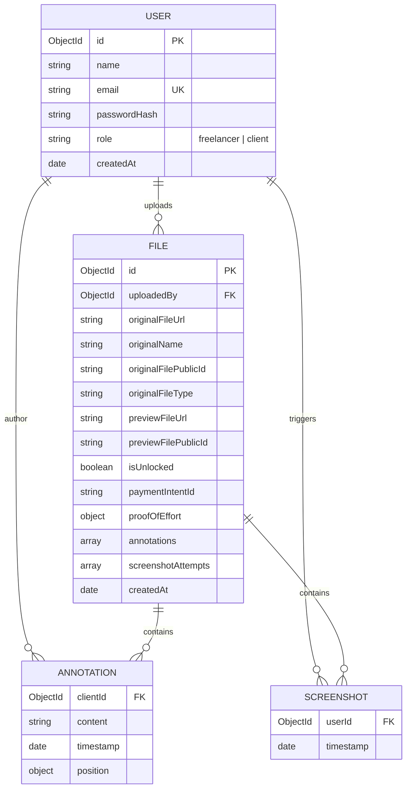
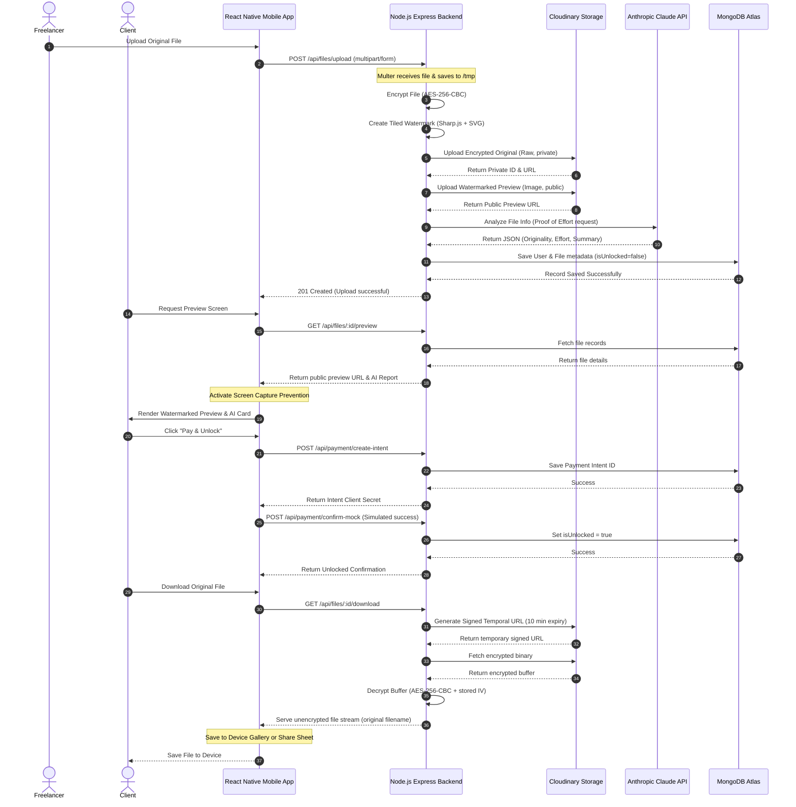

# Software Requirements Specification (SRS)
## Project: SecureDeliver — Secure Digital File Escrow & Delivery System

---

### Document Metadata
*   **System Name:** SecureDeliver
*   **Version:** 1.0.0-SRS
*   **Date:** May 18, 2026
*   **Target Workspace:** [SecureDeliver Root Directory](file:///c:/Users/s%20k/Desktop/project%20sd)
*   **Author:** AI Pair Programmer (Antigravity)
*   **Status:** Draft / Pending Review

---

## 1. Introduction

### 1.1 Purpose
This Software Requirements Specification (SRS) documents the functional, non-functional, database, and system architecture requirements for **SecureDeliver**, a secure cross-platform mobile ecosystem. SecureDeliver is engineered to eliminate the trust gap between digital freelancers and clients during the file-delivery phase of a contract. By providing secure, screenshot-protected watermarked previews and holding the high-fidelity source files under cryptographic lock until payment is validated, the application establishes a trustless escrow system for intellectual property transaction.

### 1.2 Scope
The scope of the SecureDeliver ecosystem encompasses:
1.  **React Native (Expo)** client application running on Android and iOS devices, facilitating distinct portals for Freelancers and Clients.
2.  **Node.js / Express** Restful API server executing backend business logic.
3.  **MongoDB (Mongoose ODM)** transactional store mapping application states and logs.
4.  **Cloudinary Private Storage Integration** for housing dual file representations (AES-256 encrypted raw original source files and public watermarked preview assets).
5.  **Cryptographic Escrow Engines** using `aes-256-cbc` symmetric file encryption.
6.  **Sharp.js SVG Compositor** generating high-fidelity vector watermark overlays dynamically scaled per asset.
7.  **Anthropic Claude 3.5 Sonnet Integration** providing an automated "AI Proof of Effort" structural assessment on file uploads.
8.  **Collaborative Canvas Layer** using `@shopify/react-native-skia` for drawing vector annotations and placing precise coordinate-based feedback comments directly on previews.
9.  **Stripe Mobile Checkout Subsystem** (currently simulating Webhook escrow transitions via mock Stripe client-server intents) preventing source unlocking until payment is completed.
10. **Screenshot Prevention & Audit Logging** utilizing OS-level hardware rendering controls (`expo-screen-capture`) and real-time incident auditing.

### 1.3 Definitions, Acronyms, and Abbreviations
*   **SRS:** Software Requirements Specification
*   **JWT:** JSON Web Token (RFC 7519)
*   **AES-256-CBC:** Advanced Encryption Standard with a 256-bit key size running in Cipher Block Chaining mode.
*   **IV:** Initialization Vector (a random block of bytes used to initialize a cryptographic primitive).
*   **CDN:** Content Delivery Network
*   **ODM:** Object Document Mapper
*   **SDK:** Software Development Kit
*   **API:** Application Programming Interface
*   **SVG:** Scalable Vector Graphics

### 1.4 References & System Context
The core design decisions and operational constraints mapped in this document align with:
*   Project Build Directives: [instructions.md](file:///c:/Users/s%20k/Desktop/project%20sd/instructions.md)
*   Root Server Configuration: [server.js](file:///c:/Users/s%20k/Desktop/project%20sd/backend/server.js)
*   File Controllers: [file.controller.js](file:///c:/Users/s%20k/Desktop/project%20sd/backend/controllers/file.controller.js)
*   Encryption Infrastructure: [encryption.service.js](file:///c:/Users/s%20k/Desktop/project%20sd/backend/services/encryption.service.js)

---

## 2. Overall Description

### 2.1 Product Perspective & System Components
SecureDeliver is a distributed client-server ecosystem. It replaces insecure email, Slack, or Google Drive links with a hardware-secured viewer that ensures digital assets cannot be copied, screen-recorded, or screen-captured without logging a security breach and raising real-time alerts.

```mermaid
graph TD
    classDef client fill:#3b82f6,stroke:#1d4ed8,color:#fff;
    classDef server fill:#1e293b,stroke:#334155,color:#fff;
    classDef external fill:#10b981,stroke:#047857,color:#fff;
    classDef db fill:#f59e0b,stroke:#b45309,color:#fff;

    subgraph Client ["Client Layer (React Native Expo Router)"]
        A["Login / Register Screen"]:::client
        B["Freelancer Dashboard<br>(Upload, File List)"]:::client
        C["Client Dashboard<br>(Shared Previews, Stripe Checkout)"]:::client
        D["Secure Preview Viewer<br>(expo-screen-capture, react-native-image-zoom-viewer)"]:::client
        E["Annotation Canvas<br>(@shopify/react-native-skia)"]:::client
    end

    subgraph Server ["Backend Layer (Node.js / Express API)"]
        F["Auth Router / Middleware<br>(bcrypt, jsonwebtoken)"]:::server
        G["File Router / Multer Middleware<br>(10MB limits, temp storage)"]:::server
        H["Payment Router / Escrow Logic"]:::server
        I["Encryption Service<br>(AES-256-CBC, scryptSync)"]:::server
        J["Watermark Service<br>(Sharp.js SVG composite tile)"]:::server
        K["AI Service<br>(Anthropic SDK / Claude 3.5 Sonnet)"]:::server
    end

    subgraph Db ["Database Layer"]
        L[("MongoDB Atlas<br>(Users & Files Collections)")]:::db
    end

    subgraph Ext ["External Infrastructure API Interfaces"]
        M["Cloudinary CDN Storage<br>(Raw Secured / Public Previews)"]:::external
        N["Anthropic Claude API"]:::external
        O["Stripe API (Escrow Payment Gateway)"]:::external
    end

    %% Routing Flow
    A -->|JWT Authenticated Requests| F
    B -->|File Form Data| G
    C -->|Mock Payments / Intent| H
    D -->|Get Preview Details| G
    E -->|Save Sketch / Comments| G

    %% Server Interactions
    F -->|Verify Credentials & Tokens| L
    G -->|Extract Metadata & Save Record| L
    G -->|Encrypt Raw Source| I
    G -->|Create SVG Tiled Preview| J
    G -->|Generate Proof of Effort| K
    H -->|Confirm Mock Trans. & Unlock| L

    %% External Storage / Integration
    I -->|Upload Encrypted Original| M
    J -->|Upload Public Preview| M
    K -->|Query Text File Analysis| N
    H -->|Create Escrow PaymentIntent| O
    M -->|Signed Temp URL Delivery (10 min)| D
```

### 2.2 Product Functions
SecureDeliver provides the following principal product utilities:
1.  **Dual-Channel Ingestion:** Segregates uploaded files into a locked, encrypted backend copy and a public watermarked mobile preview.
2.  **AI Labor Validation:** Automatically analyzes the context of the files using Generative AI (Claude 3.5 Sonnet) to compute an originality score and verify actual work depth (Proof of Effort).
3.  **Active Mobile Prevention:** Disables screenshotting and screen recording using native OS-level frame buffers.
4.  **Vector Drawing & Pin Annotation:** Equips clients with standard markup toolsets (Pen, Highlighter, Coordinates Comments) to pinpoint required adjustments.
5.  **Financial Escrow Release:** Locks the asset key until payment confirmation, releasing the high-resolution source only when financial checks pass.

### 2.3 User Classes and Characteristics
*   **Freelancer:** Uploads original deliverables (e.g. Design assets, documents, software zips), reviews collaborative client annotations, tracks client screenshot violations, and initiates payment requests.
*   **Client:** Inspects watermarked previews inside the secure mobile viewer, views the AI Proof of Effort index, draws markup annotations on the preview, pays the designated delivery fee ($50.00 mock standard rate), and downloads the decrypted source file directly.

### 2.4 Operating Environment
*   **Client Application:** React Native utilizing the Expo Router SDK. Operates on:
    *   iOS 14.0 or above.
    *   Android 8.0 (API level 26) or above.
*   **API Server:** Node.js v18 LTS or higher running Express.js, deployed on standard Cloud containers (e.g. Render, AWS, Heroku).
*   **Database:** MongoDB Atlas (v6.0+ Cluster) accessed via Mongoose ODM.

### 2.5 Design and Implementation Constraints
1.  **Storage Isolation:** Under no circumstances should raw, decrypted freelancer source files reside in a public storage folder or a publicly readable Cloudinary folder.
2.  **No Local Credentials:** Keys, database passwords, and API authorization secrets must be managed strictly via Environment variables on the Node.js hosting platform (and mapped locally in a `.env` file).
3.  **Network Transport:** All communications between the mobile application and server must be secured using HTTPS (TLS 1.3). During local development, developers use designated local IPv4 addresses (e.g., `http://192.168.0.102:5000/api`) within Axios interceptors to facilitate testing on physical hardware.

### 2.6 Assumptions and Dependencies
*   **Cloudinary Support:** Assumes Cloudinary accounts maintain 'authenticated' raw upload privileges.
*   **Native Modules:** Assumes host devices support native Expo security libraries (`expo-screen-capture`, `@shopify/react-native-skia`).
*   **Third-Party Services:** Relies on availability of Anthropic Claude APIs for AI report generation and Stripe Mobile SDK integrations for transaction escrow structures.

---

## 3. Functional Requirements

### 3.1 User Authentication & Biometrics
*   **Req-ID:** F-001
*   **Description:** The system must authenticate users under two explicit roles: `freelancer` and `client`.
*   **Technical Details:**
    *   Registration endpoint [POST /api/auth/register](file:///c:/Users/s%20k/Desktop/project%20sd/backend/routes/auth.routes.js#L7-L8) parses user parameters, hashes passwords via `bcrypt` (10 rounds), and persists credentials.
    *   Login endpoint [POST /api/auth/login](file:///c:/Users/s%20k/Desktop/project%20sd/backend/routes/auth.routes.js#L11-L12) validates credentials, returning a signed JWT token containing the `userId` and `role`.
    *   The Mobile client persists tokens using `AsyncStorage`.
    *   Subsequent launches invoke `react-native-biometrics` (Face ID / Fingerprint) to unlock key storage secure containers without forcing manual password re-entry.

### 3.2 Secure File Ingestion & Processing
*   **Req-ID:** F-002
*   **Description:** Freelancers must be allowed to upload files up to 10MB (specifically images, PDFs, or ZIP archives). The backend must automatically ingest, copy, encrypt, and watermark the deliverable.
*   **Technical Details:**
    *   The router utilizes a Multer-based disk storage middleware [upload.middleware.js](file:///c:/Users/s%20k/Desktop/project%20sd/backend/middleware/upload.middleware.js) enforcing a strict `10 * 1024 * 1024` byte size ceiling and checking extensions (`jpeg`, `jpg`, `png`, `pdf`, `zip`).
    *   Once uploaded, the controller divides the request:
        1.  It routes the raw file to the watermarking engine to render a preview.
        2.  It routes the raw file to the encryption service to produce an AES-256 encrypted block.
        3.  It deletes the local intermediate temporary files inside `/backend/tmp` upon completing Cloud uploads to avoid leaking assets on local storage disk clusters.

### 3.3 Dynamic Text Watermarking
*   **Req-ID:** F-003
*   **Description:** The system must generate a dynamic watermarked preview for images and multi-page design deliverables (PDF, PSD, AI).
*   **Technical Details:**
    *   The watermarker uses [watermark.service.js](file:///c:/Users/s%20k/Desktop/project%20sd/backend/services/watermark.service.js) powered by **Sharp.js**.
    *   If the uploaded asset is a raw design document (PDF/PSD/AI), the system uploads it to Cloudinary as an image resource, leverages Cloudinary converter pipelines to extract the first page, downloads the generated JPG base, and forwards it to Sharp.js.
    *   The system creates an SVG layer overlaying a tiled text pattern `SECUREDELIVER - User ID: <freelancer_id>` rotated at `-30` degrees with an opacity threshold of `0.15`.
    *   It scales the grid dynamic tile sizes (`tileSize = width / 5`) and font sizing (`fontSize = tileSize / 8`) dynamically to prevent clients from circumventing small watermarks on high-resolution assets.
    *   It merges the SVG onto the base canvas via `.composite()` and uploads it as a public preview asset.

### 3.4 In-App Secure Viewer
*   **Req-ID:** F-004
*   **Description:** Clients must only view watermarked previews within the mobile application. Sharing, exporting, and standard device screenshotting must be prevented.
*   **Technical Details:**
    *   The Preview screen [[id].js](file:///c:/Users/s%20k/Desktop/project%20sd/mobile/app/preview/%5Bid%5D.js#L19-L51) invokes `ScreenCapture.preventScreenCaptureAsync()` on mounting.
    *   This forces the mobile operating system (iOS/Android) to block standard screenshot inputs, replacing output captures or video recordings with a solid black screen.
    *   On screen unmount, `ScreenCapture.allowScreenCaptureAsync()` restores system capture capabilities.
    *   Image files enable a modular zoom viewer (`react-native-image-zoom-viewer`) inside a full-screen Modal overlay.

### 3.5 AI Proof-of-Effort Generation
*   **Req-ID:** F-005
*   **Description:** When a file is uploaded, the backend must invoke Claude 3.5 Sonnet to evaluate the work's validity and depth, rendering a summary scorecard for the client.
*   **Technical Details:**
    *   The AI parser [ai.service.js](file:///c:/Users/s%20k/Desktop/project%20sd/backend/services/ai.service.js) instantiates the Anthropic Node SDK.
    *   It issues a prompt instructing Claude to return a structured JSON string containing an `originalityScore` (0-100), `effortLevel` (Low, Medium, High), and `summary` (maximum of 2 sentences).
    *   The controller sanitizes potential Markdown syntax wrappers and saves the structured object to MongoDB under `file.proofOfEffort`.
    *   The mobile client displays this context in a sleek card on the Preview screen.

### 3.6 Collaborative Multi-Modal Annotation Canvas
*   **Req-ID:** F-006
*   **Description:** Clients must be able to overlay drawings and add coordinate-based text comments directly over the secure file preview.
*   **Technical Details:**
    *   The Annotation screen [annotate.js](file:///c:/Users/s%20k/Desktop/project%20sd/mobile/app/preview/annotate.js) features a vector workspace powered by **@shopify/react-native-skia**.
    *   Touch responders map gestures:
        *   `pen`: Standard blue stroke (width 3) tracing vector paths (`Skia.Path.Make()`).
        *   `highlighter`: Semi-transparent yellow highlight (`rgba(250,204,21,0.5)`, width 12).
        *   `text`: Captures screen coordinates `{x, y}` where the client taps, opening an input box.
    *   Saving annotations triggers [POST /api/files/:id/annotate](file:///c:/Users/s%20k/Desktop/project%20sd/backend/routes/file.routes.js#L31-L34), persisting comments, timestamps, client IDs, and 2D coordinate objects in MongoDB.

### 3.7 Escrow Payment Subsystem
*   **Req-ID:** F-007
*   **Description:** Original high-fidelity sources must remain locked until standard escrow payments are confirmed.
*   **Technical Details:**
    *   In the current prototype phase, [payment.controller.js](file:///c:/Users/s%20k/Desktop/project%20sd/backend/controllers/payment.controller.js) implements a mock Stripe API sequence:
        1.  `createPaymentIntent` simulates a Stripe payment sheet, registers a unique `pi_mock_<timestamp>` string, sets transaction parameters ($50.00 USD represented as 5000 cents), and returns a client secret.
        2.  `confirmMockPayment` is executed by the client to confirm success. In a production environment, this is replaced by the cryptographically verified `stripe.webhooks.constructEvent` parser.
        3.  The controller updates the target document's state to `isUnlocked = true` in MongoDB.

### 3.8 Secure Unlock & Signed Temporary URL Delivery
*   **Req-ID:** F-008
*   **Description:** Once payment is confirmed, clients can download the unencrypted source file using a secure, temporary, and signed URL.
*   **Technical Details:**
    *   When the client clicks "Download Original File", the mobile app requests [GET /api/files/:id/download](file:///c:/Users/s%20k/Desktop/project%20sd/backend/controllers/file.controller.js#L131-L198).
    *   The controller verifies `file.isUnlocked === true`. If false, it immediately blocks the request with a `403 Forbidden` error.
    *   If unlocked, the backend generates an authenticated signed Cloudinary URL with a strict expiry parameter set to `10 minutes` (600 seconds) from request generation.
    *   The backend retrieves the encrypted data buffer from Cloudinary via Axios, decrypts it using [encryption.service.js](file:///c:/Users/s%20k/Desktop/project%20sd/backend/services/encryption.service.js) via `aes-256-cbc`, and streams the decrypted binary to the client using the original file extension and filename (avoiding `.bin` fallback issues).
    *   The mobile client downloads the stream using `expo-file-system`. Images are saved to the device's photo library via `expo-media-library`; other document formats are routed through the device's native share sheet (`expo-sharing`).

### 3.9 Screenshot Detection & Incident Auditing
*   **Req-ID:** F-009
*   **Description:** Every screenshot attempt must be blocked, recorded in the database, and trigger an alert to notify the freelancer.
*   **Technical Details:**
    *   When a screenshot is detected by the event listener in [[id].js](file:///c:/Users/s%20k/Desktop/project%20sd/mobile/app/preview/%5Bid%5D.js#L36-L38), the mobile application issues an asynchronous request to [POST /api/files/:id/screenshot-alert](file:///c:/Users/s%20k/Desktop/project%20sd/backend/controllers/file.controller.js#L252-L263).
    *   The controller appends a new incident record `{ userId: req.user.userId, timestamp: Date.now() }` to the `screenshotAttempts` array in MongoDB.
    *   The system notifies the user of the security breach with an in-app warning.

---

## 4. Data and Schema Requirements

### 4.1 MongoDB Schema Architecture
The application uses two core collection schemas: `User` and `File`. All relations are linked via MongoDB ObjectIds.



### 4.2 Detailed Database Schemas

#### User Schema
Defined in [User.model.js](file:///c:/Users/s%20k/Desktop/project%20sd/backend/models/User.model.js):
```js
const userSchema = new mongoose.Schema({
  name: {
    type: String,
    required: true,
    trim: true
  },
  email: {
    type: String,
    required: true,
    unique: true,
    lowercase: true,
    trim: true
  },
  passwordHash: {
    type: String,
    required: true
  },
  role: {
    type: String,
    enum: ['freelancer', 'client'],
    default: 'client'
  },
  createdAt: {
    type: Date,
    default: Date.now
  }
});
```

#### File Schema
Defined in [File.model.js](file:///c:/Users/s%20k/Desktop/project%20sd/backend/models/File.model.js):
```js
const fileSchema = new mongoose.Schema({
  uploadedBy: {
    type: mongoose.Schema.Types.ObjectId,
    ref: 'User',
    required: true
  },
  originalFileUrl: {
    type: String, // encrypted, private
    required: true
  },
  originalName: { type: String },
  originalFilePublicId: {
    type: String,
    required: true
  },
  originalFileType: {
    type: String,
    default: 'upload'
  },
  previewFileUrl: {
    type: String, // watermarked, viewable in-app
    required: true
  },
  previewFilePublicId: {
    type: String,
    required: true
  },
  isUnlocked: {
    type: Boolean,
    default: false
  },
  paymentIntentId: {
    type: String
  },
  proofOfEffort: {
    originalityScore: Number,
    effortLevel: String,
    summary: String
  },
  annotations: [
    {
      clientId: { type: mongoose.Schema.Types.ObjectId, ref: 'User' },
      content: String,
      timestamp: { type: Date, default: Date.now },
      position: { x: Number, y: Number }
    }
  ],
  screenshotAttempts: [
    {
      userId: { type: mongoose.Schema.Types.ObjectId, ref: 'User' },
      timestamp: { type: Date, default: Date.now }
    }
  ],
  createdAt: {
    type: Date,
    default: Date.now
  }
});
```

### 4.3 Cryptographic Key Architecture
To secure original files before uploading to Cloudinary:
1.  **Key Derivation Function:** `crypto.scryptSync(process.env.JWT_SECRET || 'fallback-secret', 'salt', 32)` derives a cryptographically strong 256-bit (32-byte) key.
2.  **Encryption:** Using `aes-256-cbc`, a random 16-byte IV is generated for every file.
3.  **Encrypted Payload Format:** The raw IV is prepended directly to the ciphertext:
    ```
    +-----------------------+---------------------------------------+
    | 16-Byte Random IV     | AES-256-CBC Encrypted Source Payload  |
    +-----------------------+---------------------------------------+
    ```
4.  **Decryption:** The server slices the first 16 bytes of the downloaded stream to extract the IV, then decrypts the remainder of the payload using the derived key.

---

## 5. Non-Functional Requirements

### 5.1 Security Requirements
*   **Asset Secrecy:** Encrypted deliverables uploaded as `raw` authenticated types to Cloudinary must prevent public, unauthorized access.
*   **JWT Integrity:** Session authorization requires the standard format header: `Authorization: Bearer <JWT_Token>`.
*   **Input Sanitization:** Express servers run `helmet()` to secure HTTP headers, and API routers validate JSON objects to prevent NoSQL injection.

### 5.2 Performance & Benchmarks
*   **API Latency:** Database queries and standard user checks must resolve in under `2.0 seconds`.
*   **Dynamic Processing Overhead:** Watermarking and encryption processing for standard files (<10MB) must complete within `5.0 seconds`.
*   **Smooth Rendering:** The Secure Preview viewer and Annotation Canvas target `60 fps` render speeds.

### 5.3 Reliability & Fault Tolerance
*   **AI Service Failure:** If the Claude API times out or fails, the server must handle the error gracefully and return fallback parameters (`originalityScore: 0`, `effortLevel: 'Unknown'`), preventing file upload failures.
*   **No Unlocked Leaks:** If a transaction fails, the `isUnlocked` status must remain false under all conditions.

### 5.4 Usability & Native Mobile UX
*   **Sleek Dark Theme:** The mobile application features a premium dark theme (`backgroundColor: '#0f172a'`) styled for a high-end look.
*   **User Feedback:** All long-running actions (e.g., payments, uploads, downloads) display clear loaders and disable duplicate buttons to prevent double-clicks.

---

## 6. External Interface Requirements

### 6.1 User Interfaces
The application includes the following interfaces:
1.  **Freelancer Dashboard:** Displaying uploaded assets, active client lists, file unlock statuses, and reviewable client annotations.
2.  **Client Dashboard:** A clean portal featuring shared items categorized by unlock status ("Pending Payment" / "Ready to Download").
3.  **Secure Viewer Screen:** Featuring the watermarked image, AI Proof of Effort card, and payment triggers.
4.  **Skia Annotation Workspace:** A dynamic overlay providing sketch and marker tools for collaborative feedback.

### 6.2 Software Interfaces
*   **MongoDB Atlas:** Hosted NoSQL database for secure, scalable data storage.
*   **Cloudinary Storage API:** High-capacity CDN platform hosting all uploaded assets.
*   **Anthropic Claude API:** Generative AI engine processing work authenticity reports.
*   **Stripe SDK (Test Mode):** Mock payment engine simulating financial escrow verification.

### 6.3 Communication Protocols
*   **HTTPS:** Secure REST API endpoint communications.
*   **Multipart/Form-Data:** Structured format for binary file transfers during uploads.
*   **JSON payload:** Serialization format for standard API requests and responses.

---

## 7. System Registry & Roadmap

### 7.1 Backend API Endpoint Specification Table

| Method | Endpoint | Authorization | Description | Code Reference |
| :--- | :--- | :---: | :--- | :---: |
| **POST** | `/api/auth/register` | Public | Registers a new user (`freelancer`/`client`) | [auth.routes.js](file:///c:/Users/s%20k/Desktop/project%20sd/backend/routes/auth.routes.js) |
| **POST** | `/api/auth/login` | Public | Validates credentials, issues JWT token | [auth.routes.js](file:///c:/Users/s%20k/Desktop/project%20sd/backend/routes/auth.routes.js) |
| **POST** | `/api/files/upload` | JWT Bearer | Uploads, encrypts, watermarks, and saves a file | [file.routes.js](file:///c:/Users/s%20k/Desktop/project%20sd/backend/routes/file.routes.js) |
| **GET** | `/api/files/my-files` | JWT (Freelancer) | Lists all files uploaded by the freelancer | [file.routes.js](file:///c:/Users/s%20k/Desktop/project%20sd/backend/routes/file.routes.js) |
| **GET** | `/api/files/shared-files` | JWT (Client) | Lists all files available to the client | [file.routes.js](file:///c:/Users/s%20k/Desktop/project%20sd/backend/routes/file.routes.js) |
| **GET** | `/api/files/:id/preview` | JWT Bearer | Gets the preview URL and AI Proof of Effort | [file.routes.js](file:///c:/Users/s%20k/Desktop/project%20sd/backend/routes/file.routes.js) |
| **GET** | `/api/files/:id/download` | JWT Bearer | Decrypts and downloads the original source file | [file.routes.js](file:///c:/Users/s%20k/Desktop/project%20sd/backend/routes/file.routes.js) |
| **POST** | `/api/files/:id/annotate` | JWT Bearer | Saves a drawing path or comment coordinates | [file.routes.js](file:///c:/Users/s%20k/Desktop/project%20sd/backend/routes/file.routes.js) |
| **GET** | `/api/files/:id/annotations` | JWT Bearer | Gets all annotations for the specified file | [file.routes.js](file:///c:/Users/s%20k/Desktop/project%20sd/backend/routes/file.routes.js) |
| **POST** | `/api/files/:id/screenshot-alert` | JWT Bearer | Logs a screenshot attempt and alerts the freelancer | [file.routes.js](file:///c:/Users/s%20k/Desktop/project%20sd/backend/routes/file.routes.js) |
| **POST** | `/api/payment/create-intent` | JWT Bearer | Initiates a Stripe transaction (returns mock intent) | [payment.routes.js](file:///c:/Users/s%20k/Desktop/project%20sd/backend/routes/payment.routes.js) |
| **POST** | `/api/payment/confirm-mock` | JWT Bearer | Simulates Stripe webhook delivery to unlock the file | [payment.routes.js](file:///c:/Users/s%20k/Desktop/project%20sd/backend/routes/payment.routes.js) |

### 7.2 File Delivery & Escrow Release Sequence Diagram



### 7.3 System Audit Registry & Hardening Controls
To secure the file transfer lifecycle, the application enforces these rules:
1.  **Decryption Isolation:** Private keys never leave the server. Unlocked files are decrypted entirely in-memory on the backend and streamed to the client; decrypted source files are never cached on the server's disk storage.
2.  **No Decrypted URLs:** Decrypted, unencrypted source files are never assigned a public URL on Cloudinary or any other public server.
3.  **Strict Signature Checks:** Every file download requires a valid JWT token and verifies `isUnlocked === true` against the database record before initiating delivery.

---
*End of Software Requirements Specification (SRS) Document.*
